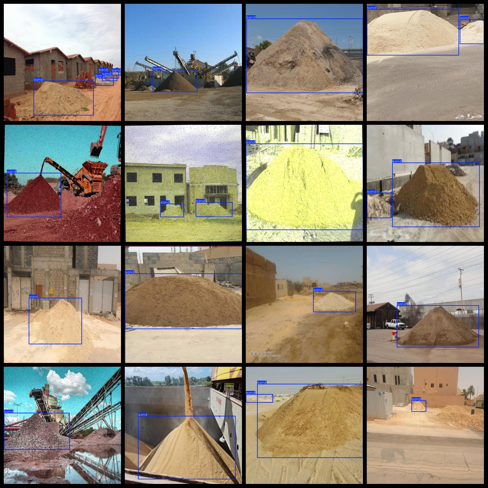

# Sand Pile Dataset 957 images, VOC+YOLO format

The dataset consists of 957 images in the VOC+YOLO format.

The dataset is organized into three folders: JPEGImages, Annotations, and labels.

The JPEGImages folder contains a total of 957 jpg images.

The Annotations folder contains a total of 957 xml files.

The labels folder contains a total of 957 txt files.

There are 1 category of labels: ["sand"]

Each label has 1389 bounding boxes (as per the yolo format).

The total number of bounding boxes is 1389.

The image resolution is clear.

The images have been enhanced.

The GitHub repository location is datasets_sl.

The shape of the labels is rectangular boxes used for object detection identification.

Special Note: No guarantee is made for the accuracy or precision of the trained models or weight files. The dataset provides accurate and reasonable annotations only.

Annotation and picture details are as follows:

## Images

---

Here is a pay link on Stripe (https://buy.stripe.com/3cs8yP7sY87d0vu9AB). Please contact me lonlonago@foxmail.com after funding $89, and I will send you a complete data files, thank you!

